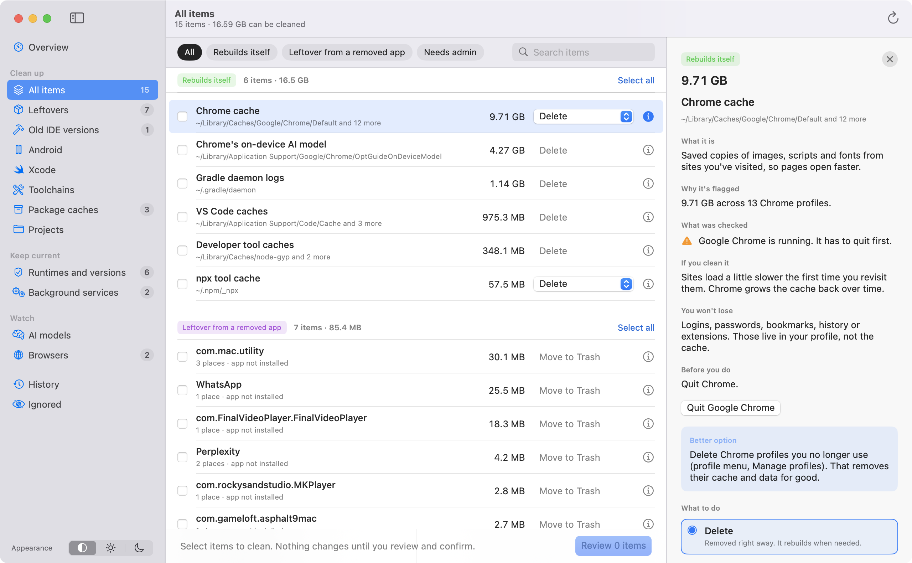
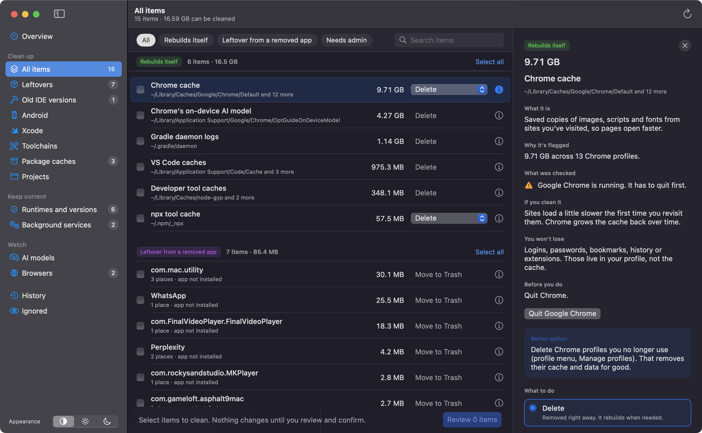
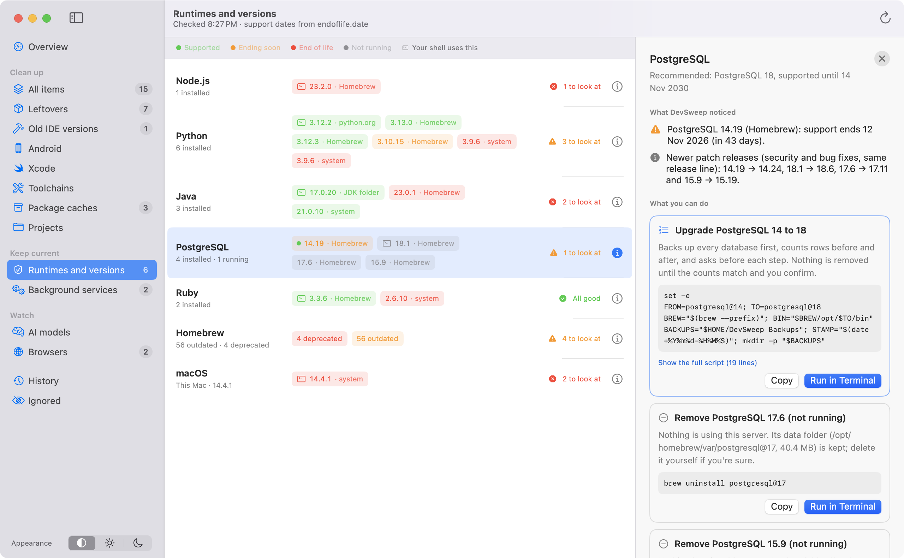
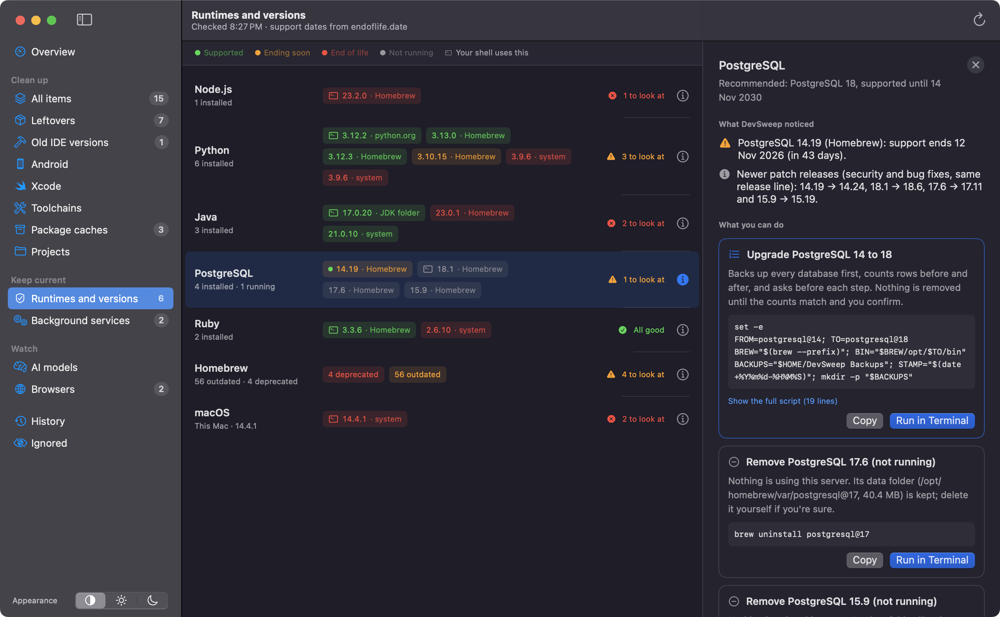
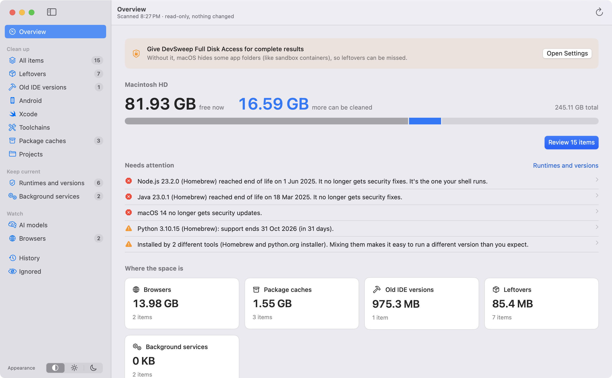
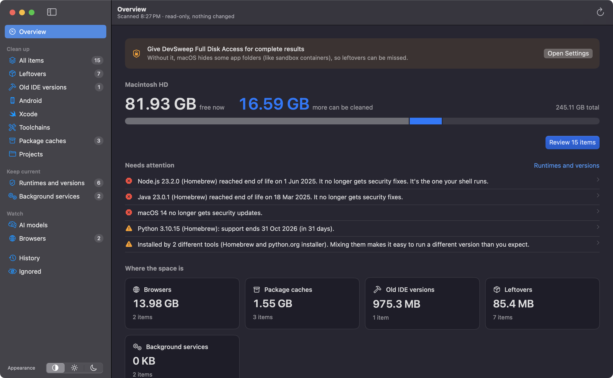

# DevSweep

A Mac app that finds what's safe to clean on a developer's machine, and
explains every item before you touch it.

Developer Macs fill up with things no general cleaner understands: Android
system images no emulator uses, Kotlin/Native compilers from projects you
finished a year ago, simulator runtimes, settings from three Android Studio
versions back, npm and Gradle caches, and files from apps you removed long
ago. DevSweep finds them, tells you what each one is, what was checked, and
exactly what happens if you remove it.

<picture>
  <source media="(prefers-color-scheme: dark)" srcset="docs/screenshots/items-dark.png">
  
</picture>

## Screenshots

Light and dark mode follow your Mac, or pick one in the sidebar.

| | Light | Dark |
|---|---|---|
| **Every item explained.** The ⓘ panel says what it is, why it was flagged, what was checked on your Mac, what you won't lose, and a better option when there is one. |  |  |
| **Review before anything changes.** Items are grouped by what will actually happen: deleted right away (rebuilds itself) or moved to the Trash (restorable). Apps that must quit first are flagged, with a button to quit them. |  |  |
| **Runtimes and versions.** Every Node, Python, Java, PostgreSQL, Go and Ruby install, who installed it, which one your shell runs, and whether it's still supported. Fixes are shown as commands and run in Terminal, including a guided PostgreSQL upgrade. |  |  |
| **History and undo.** Everything DevSweep changed, with Restore for anything still in the Trash. |  |  |
| **Overview.** Free space, what can be cleaned, and where it is. |  |  |
| **Menu bar.** Space at a glance and a quick scan. |  |  |

## How it behaves

- **Scanning never changes anything.** You pick items, review them, and
  confirm. The review sheet shows the exact commands that will run.
- **Everything is explained.** Each item has an ⓘ panel: what it is, why it
  was flagged, what was checked on your Mac, what happens if you clean it,
  what you won't lose, and how to undo it.
- **Reversible by default.** Anything that could matter goes to the Trash
  and can be restored from History. Only things that rebuild on their own
  (caches) are deleted outright, using the tool's own command where there is
  one (`npm cache clean`, `pip cache purge`, `xcrun simctl`...).
- **Risk decides the options.** Items are labelled *Rebuilds itself*, *Old
  version*, *Leftover from a removed app*, *Holds your data* or *Needs
  admin*. Things that hold data never get a plain delete; things outside your
  home folder are shown as commands for you to run.
- **A hard safety net.** Whatever a rule says, DevSweep refuses to remove
  anything outside your home folder, top-level visible folders, or
  protected folders like `~/Library` and `~/.ssh`.
- **No AI and no network needed** for scanning and cleaning.

## What it finds (v0.1)

| Area | Examples |
|---|---|
| Leftovers | Files from uninstalled apps, matched by bundle ID across 11 Library folders |
| Background services | Launch agents and daemons whose program no longer exists |
| Old IDE versions | Android Studio and JetBrains settings from older versions, stale VS Code/Cursor extensions |
| Android | System images no emulator uses, old build tools, platforms, NDKs, Gradle versions |
| Xcode | DerivedData, device support files, superseded simulator runtimes, unavailable simulators |
| Toolchains | Old Kotlin/Native compilers, Intel builds on Apple silicon, Java versions older than 11 |
| Package caches | npm, npx, pip, Homebrew, Yarn, CocoaPods, SwiftPM, Gradle, Go, Cargo |
| Projects | `node_modules`, virtualenvs and Pods in projects untouched for 30 days |
| Browsers and AI models | Chrome/Edge/Brave caches, Chrome's on-device model, Whisper, Hugging Face, PyTorch |

## Runtimes and versions (v0.2)

A separate screen answers a different question: are the tools you rely on
still supported, and do you have too many copies of them?

- **Finds every install** of Node.js, Python, Java, PostgreSQL, Go and Ruby,
  whoever installed it: Homebrew, nvm, fnm, Volta, asdf, mise, pyenv, uv,
  rbenv, RVM, SDKMAN, the official installers, Postgres.app, IDE-bundled JDKs
  and macOS itself.
- **Knows which one you actually use** by asking your login shell for its
  PATH, so it can tell you when a python.org copy is shadowing Homebrew's.
- **Checks support dates** from [endoflife.date](https://endoflife.date),
  cached for a day and usable offline: release date, end of support, latest
  patch, LTS.
- **Flags** end-of-life versions, versions ending within 120 days, the same
  tool installed by several managers, missing patch releases, PostgreSQL
  servers nobody runs, deprecated or outdated Homebrew packages, and macOS
  updates.
- **Suggests fixes for the tool that owns each install** (`brew`, `nvm`,
  `pyenv`, `sdk`...). Copy them, or run them in Terminal: a window opens,
  lists the commands and waits for Return, so nothing runs unseen and `sudo`
  can ask for your password.
- **Guided PostgreSQL upgrade** for Homebrew installs: backs up every database
  with `pg_dumpall`, counts rows in every table, switches servers, restores,
  counts again and compares, and only then asks before removing the old
  version. The backup stays in `~/DevSweep Backups`.
- Apps that are part of macOS or an IDE (like macOS's own Python 3.9) are
  reported but never offered for removal.

From the command line: `swift run devsweep runtimes` (or `--json`).

## Install

Download the latest `.dmg` from [Releases](https://github.com/karuneshpalekar/DevSweep/releases),
open it, and drag DevSweep to Applications.

Releases aren't notarized by Apple (that needs a paid developer account), so
macOS asks you to allow DevSweep the first time:

- **macOS 14:** right-click DevSweep in Applications, choose **Open**, then **Open** again.
- **macOS 15 and later:** try to open it, then click **Open Anyway** in System
  Settings, Privacy & Security.
- **Or:** `xattr -dr com.apple.quarantine /Applications/DevSweep.app`

## Build and run

Requires macOS 14+, Xcode 15.3+ and [XcodeGen](https://github.com/yonaskolb/XcodeGen).

```bash
brew install xcodegen
./install.sh          # builds Release and installs to /Applications
```

Or open the project in Xcode: `./generate.sh && open DevSweep.xcodeproj`.

For complete results, give DevSweep **Full Disk Access** (System Settings,
Privacy & Security). Without it macOS hides some app folders.

To sign with your own team (so the Full Disk Access grant survives
rebuilds), copy `Config/Local.xcconfig.example` to `Config/Local.xcconfig`.

### Command line

The engine is a Swift package with a CLI, handy for testing rules:

```bash
cd Core
swift run devsweep scan              # read-only scan
swift run devsweep scan --explain    # include the explanation and checks
swift run devsweep scan --json
swift run devsweep history
swift test
```

## Writing rules

Rules are YAML files in `Core/Sources/DevSweepCore/Rules/`. You can also
drop your own packs into `~/Library/Application Support/DevSweep/Rules/`
(a rule with the same `id` overrides the bundled one).

```yaml
rules:
  - id: pip-cache
    title: pip cache
    category: packageCaches      # leftovers, ideVersions, android, xcode, toolchains,
                                 # packageCaches, browsers, projects, aiModels, backgroundServices
    risk: rebuilds               # rebuilds, oldVersion, leftover, holdsData, needsAdmin
    minSizeMB: 50
    blockers: ["SomeApp"]        # optional: apps that must be closed first
    detector:
      kind: paths
      paths: ["~/Library/Caches/pip"]
    actions:                     # first one is the default
      - kind: command
        label: Delete
        command: ["pip3", "cache", "purge"]
      - kind: delete
    explain:
      what: "Python packages pip has downloaded or built."
      why: "{{size}} of downloaded and built packages."
      ifDeleted: "The next pip install downloads packages again."
      wontLose: "Packages already installed in your environments."
```

Explanations can use `{{placeholders}}` filled from what the scan found:
`size`, `count`, `path`, plus detector-specific facts such as `version`,
`newest`, `kept`, `versions`, `app`, `level` or `project`.

Detector kinds: `paths`, `versionedSiblings` (keep the newest N of versioned
folders), `orphanedAppData`, `orphanedLaunchServices`, `androidSystemImages`,
`simulatorRuntimes`, `unavailableSimulators`, `editorExtensions`, `oldJDKs`,
`staleProjectArtifacts`. See the bundled packs for examples of each.

Good rules are conservative. If you're not sure something is safe, label it
`holdsData` and say why in `explain`.

## Releasing

Write `docs/release-notes/<version>.md`, commit, then run
`scripts/release.sh <version>`. It builds a Release, packages a DMG with a
checksum, tags the commit and publishes a GitHub release.

Builds are ad-hoc signed. If a **Developer ID Application** certificate and
notary credentials (`xcrun notarytool store-credentials devsweep ...`) are
in the keychain, the script signs with Developer ID and notarizes instead.

## Updating the screenshots

Debug builds can walk through every screen in light and dark mode and save
the README images. The app captures only its own windows, so no screen
recording permission is needed:

```bash
DEVSWEEP_SHOTS="$PWD/docs/screenshots" \
  build/Build/Products/Debug/DevSweep.app/Contents/MacOS/DevSweep
```

## Roadmap

- More runtimes (PHP, Rust toolchains, .NET, Flutter) and conda environments
- Guided upgrades for MySQL and Redis
- Scheduled scans and a disk-space alert from the menu bar
- Running admin commands behind a single password prompt

## License

MIT
